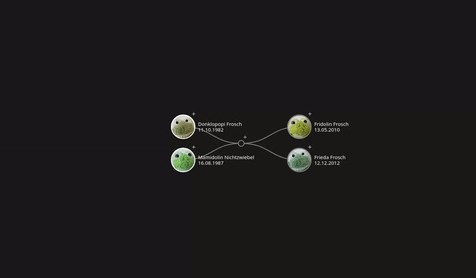

# Description

Explore and edit your family history seamlessly with this JavaScript-based software, offering an intuitive interface to visualize, browse, and effortlessly update the structure and details of your family tree, including names, birthdays, and more.



This is a re-implementation of [js_family_tree](https://github.com/BenPortner/js_family_tree), with the following improvements:

* Simplified overall code structure
* No need to define `own_unions` or `parent_unions` or any `union` at all :-)
* More robust DAG recreation when opening/closing nodes
* Introduction of the notion of relationships
* Possibility to open parts of the DAG in both directions (parents and children)
* Possibility to collapse parts by clicking onto a family node
* Transfer node-attached data during recreation in order to easily keep track of properties
* Provide simple editor functionality when clicking on the *+* symbol

Based on **js_family_tree**

* Author: Benjamin W. Portner
* License: GNU General Public License v3.0
* Project: [js_family_tree](https://github.com/BenPortner/js_family_tree)
* Initially based on the [collapsible d3 tree example](https://bl.ocks.org/d3noob/43a860bc0024792f8803bba8ca0d5ecd) by d3noob

Modified package: **familienbaum**

* Author: Nicolodemus
* Re-implementation of **js_family_tree**
* License: GNU General Public License v3.0

# Used Components

Following components are used:

d3

|Package|d3|
|:-------|:----|
|Homepage|[https://d3js.org/](https://d3js.org/)|
|Repository|[https://github.com/d3/d3](https://github.com/d3/d3)|
|License|ISC License|

# Example

The file [index.html](index.html) provides an example.

# Data description

The file [input.js](input.js) provides the input data with following properties:

|Property|Description|
|--------|-----------|
|start|Enter here the key of a member or a family from where the visualization will start|
|members|Contains data about each member. Make sure each member key is unique (e.g. *I500*, *I501*, etc.).|
|links|Defines how families and persons are linked. Arbitrary family keys like *U500* can be introduced in this container. Describe a partnership by adding two links *[ I500, U500 ]* and *[ I501, U500 ]*. Add children to the partnership by adding a link *[ U500, I502 ]*. |

Simple example:

```javascript
let _input = {
	"start": "U500",
	"members": {
		"I500": {
			"name": "Mamidolin Nichtzwiebel",
			"birth_date": "16.08.1987",
			"death_date": "",
			"image_path": "images/Mamidolin Nichtzwiebel 1987.jpg"
		},
		"I501": {
			"name": "Donklopopi Frosch",
			"birth_date": "11.10.1982",
			"death_date": "",
			"image_path": "images/Donklopopi Frosch 1982.jpg"
		},
		"I502": {
			"name": "Fridolin Frosch",
			"birth_date": "13.05.2010",
			"death_date": "",
			"image_path": "images/Fridolin Frosch 2010.jpg"
		},
		"I503": {
			"name": "Frieda Frosch",
			"birth_date": "12.12.2012",
			"death_date": "",
			"image_path": "images/Frieda Frosch 2012.jpg"
		}
	},
	"links": [
		[
			"I500",
			"U500"
		],
		[
			"I501",
			"U500"
		],
		[
			"U500",
			"I502"
		],
		[
			"U500",
			"I503"
		]
	]
};
```
